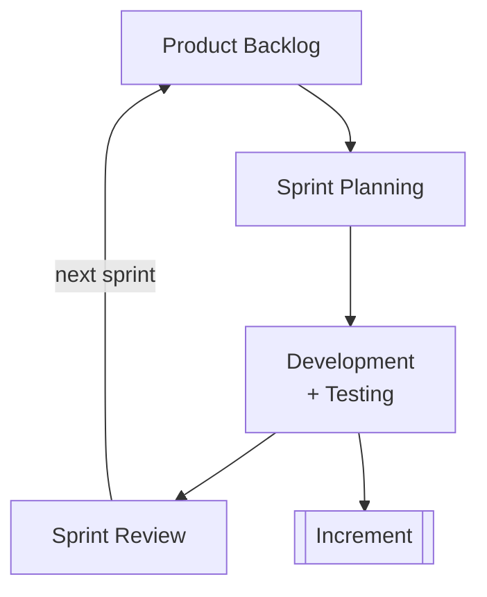
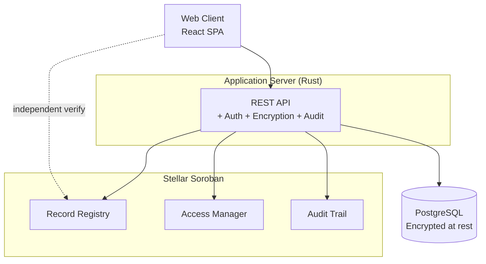
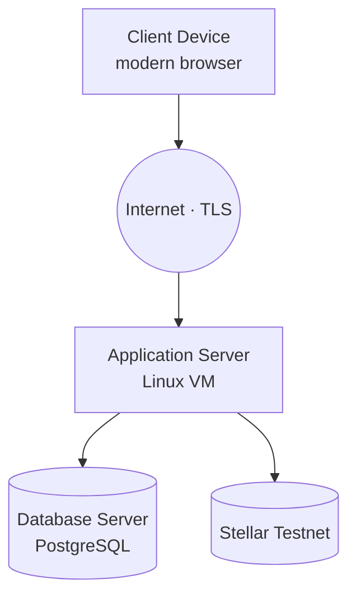
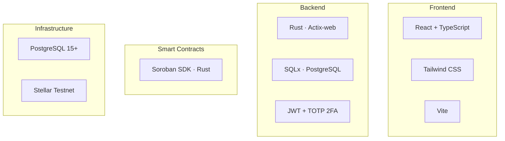
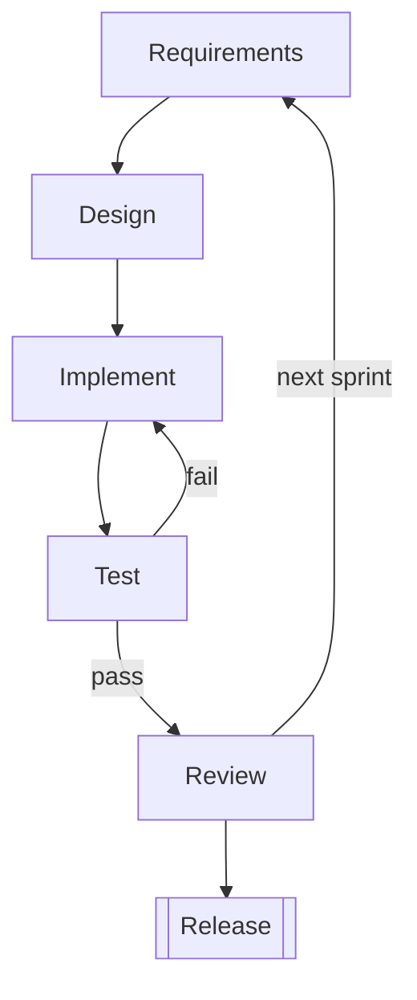
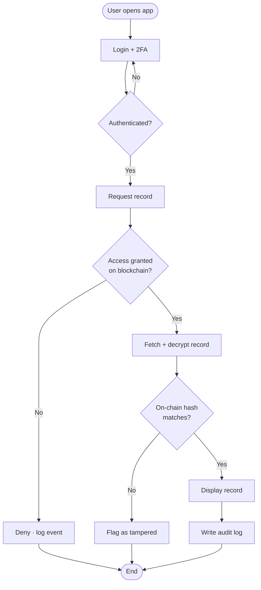
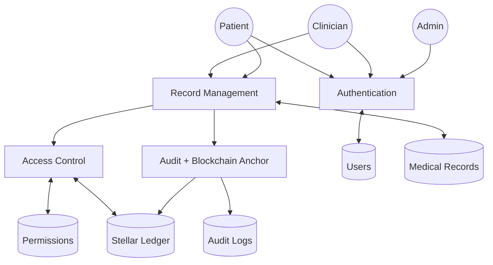
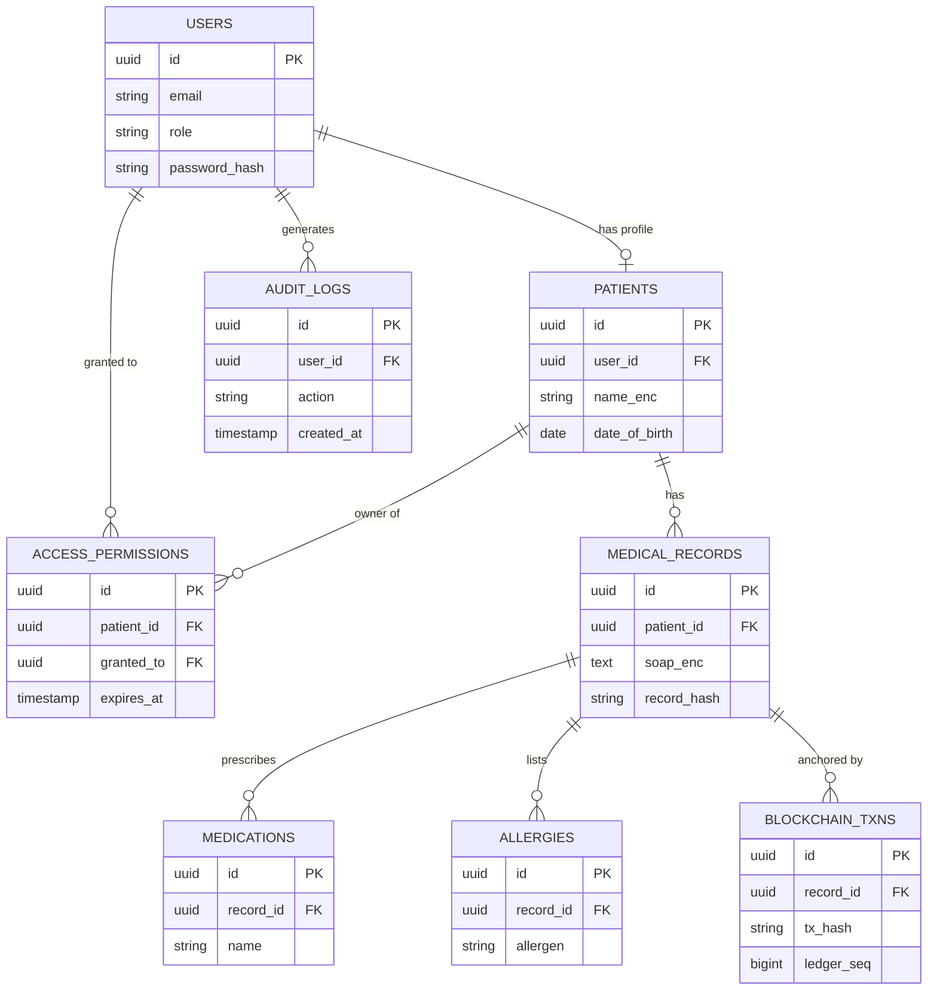
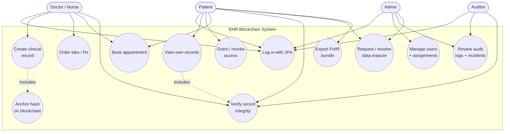

# Chapter 3 — Methodology Diagrams

Mermaid source for every diagram called out in Chapter 3. Simplified for
print: each diagram focuses on the concepts a reader needs to understand
the method, not every implementation detail. Render with GitHub preview,
VS Code Mermaid extension, or `mermaid.live` and export SVG at ≤ 6.5"
width for insertion into the paper.

---

## 3.1 Research Design — Agile

---

## 3.2 Proposed Architecture

---

## 3.3 System Requirements

### 3.3.1 Hardware

### 3.3.2 Software d
 

---

## 3.4 Methods and Tools

### 3.4.1 System Development Method (Agile)

### 3.4.2 Tools

#### 3.4.2.1 Flowchart — Access a Record

#### 3.4.2.2 Data Flow Diagram

#### 3.4.2.3 Entity-Relationship Diagram

#### 3.4.2.4 Use Case Diagram

