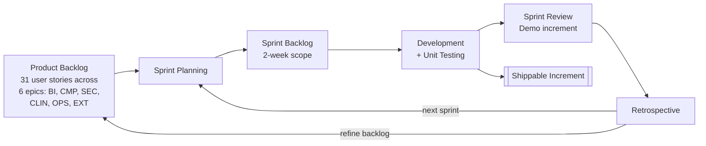
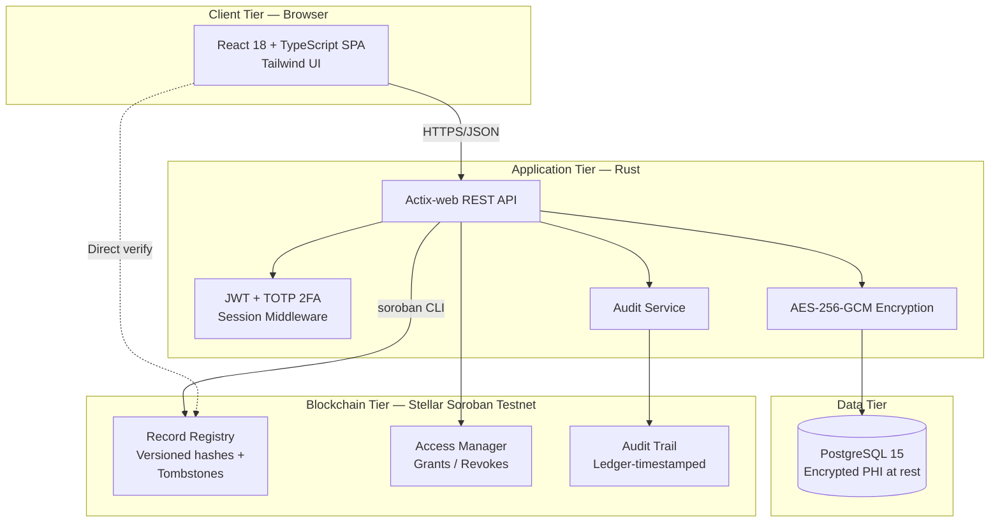
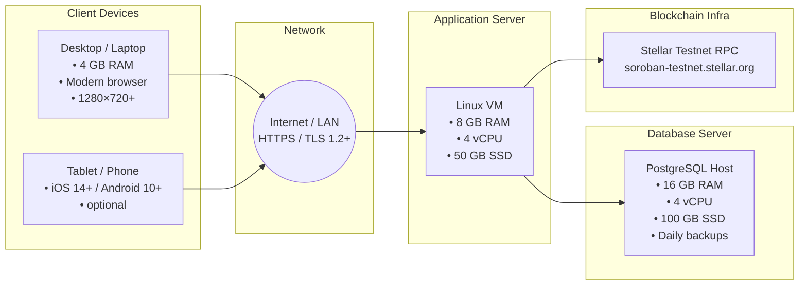
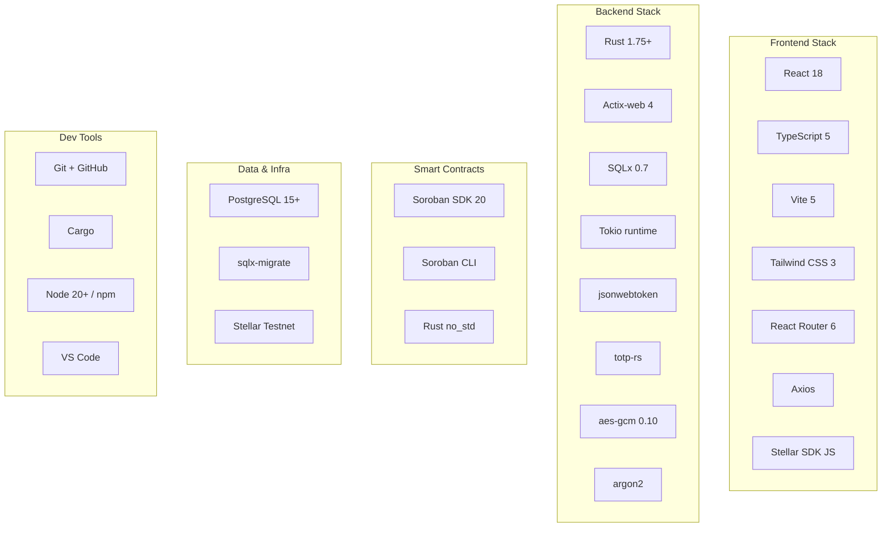
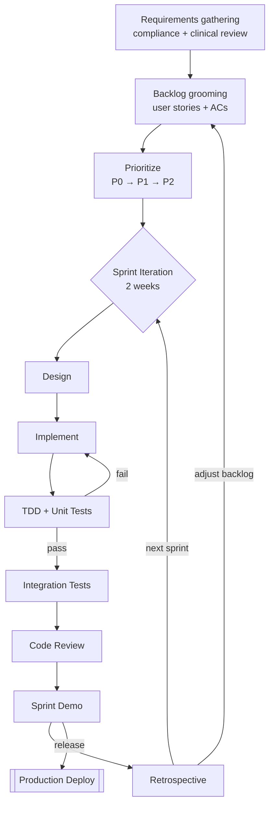
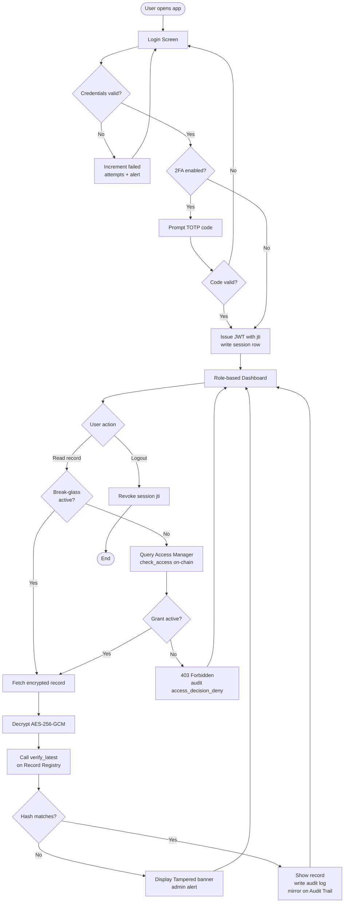
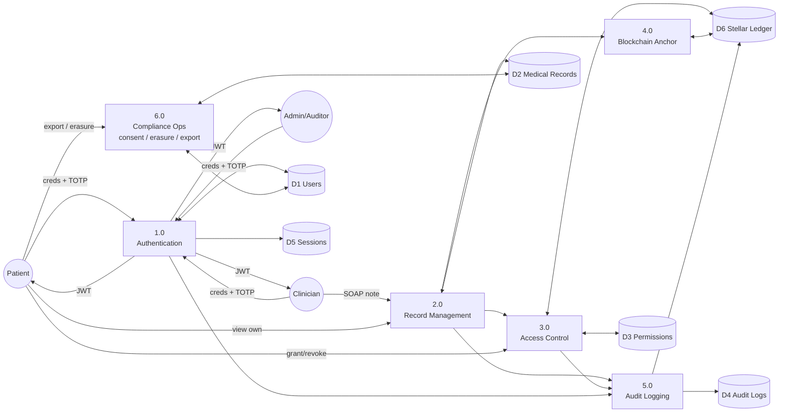
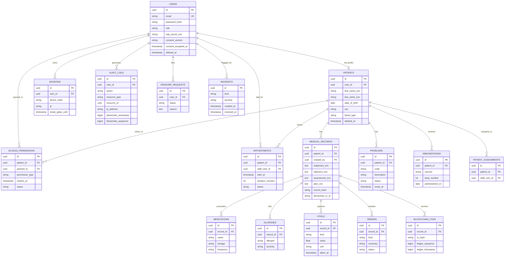
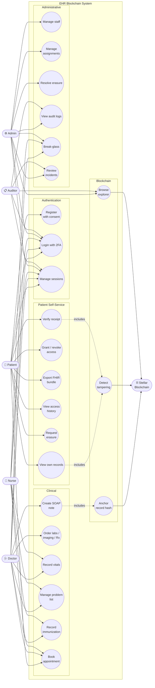

# Chapter 3 — Methodology Diagrams

Mermaid source for every diagram called out in Chapter 3 of the capstone paper.
Render with any Mermaid-compatible tool (GitHub preview, VS Code Mermaid
extension, `mermaid.live`, mkdocs-mermaid, Notion, etc.).

---

## 3.1 Research Design — Agile Scrum Cycle

---

## 3.2 Proposed Architecture (Four-Tier)

---

## 3.3 System Requirements

### 3.3.1 Hardware Requirements

### 3.3.2 Software Requirements

---

## 3.4 Methods and Tools

### 3.4.1 Methods — System Development Diagram (Agile/Scrum)

### 3.4.2 Tools

#### 3.4.2.1 Flowchart of the Proposed System — Record Access Workflow

#### 3.4.2.2 Data Flow Diagram — Level 1

#### 3.4.2.3 Entity-Relationship Diagram

#### 3.4.2.4 Use Case Diagram

