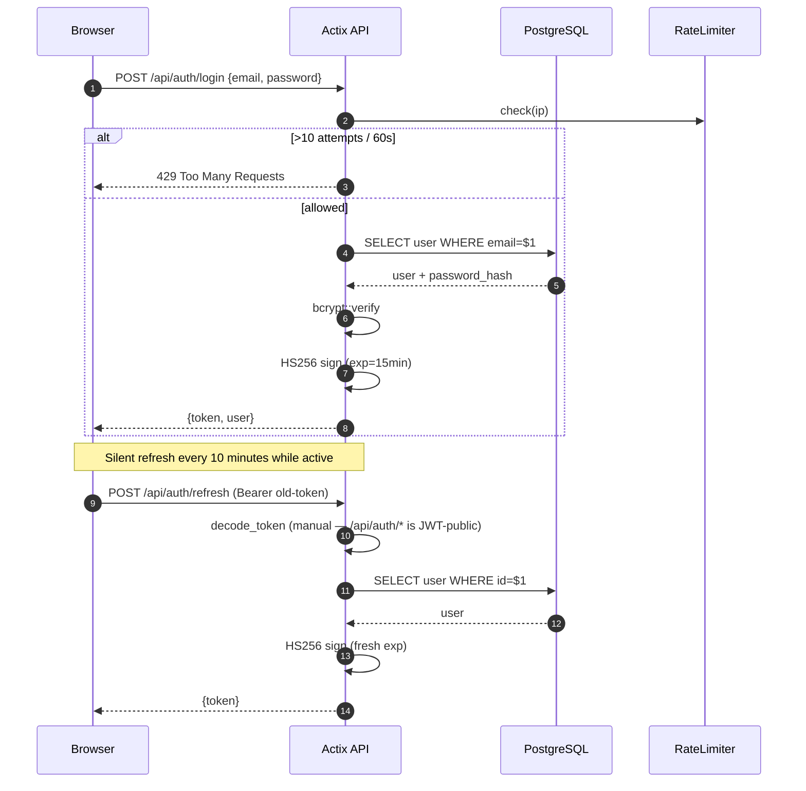
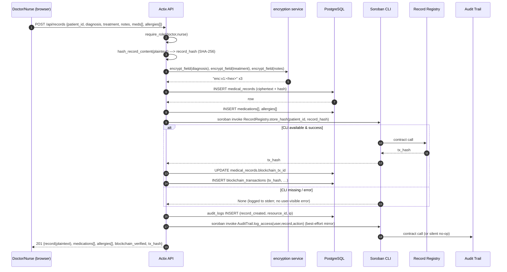
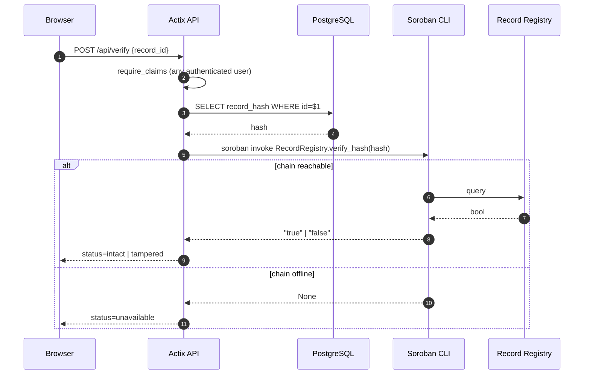
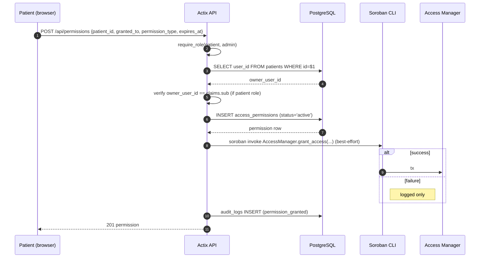
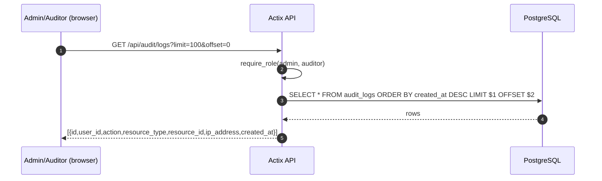
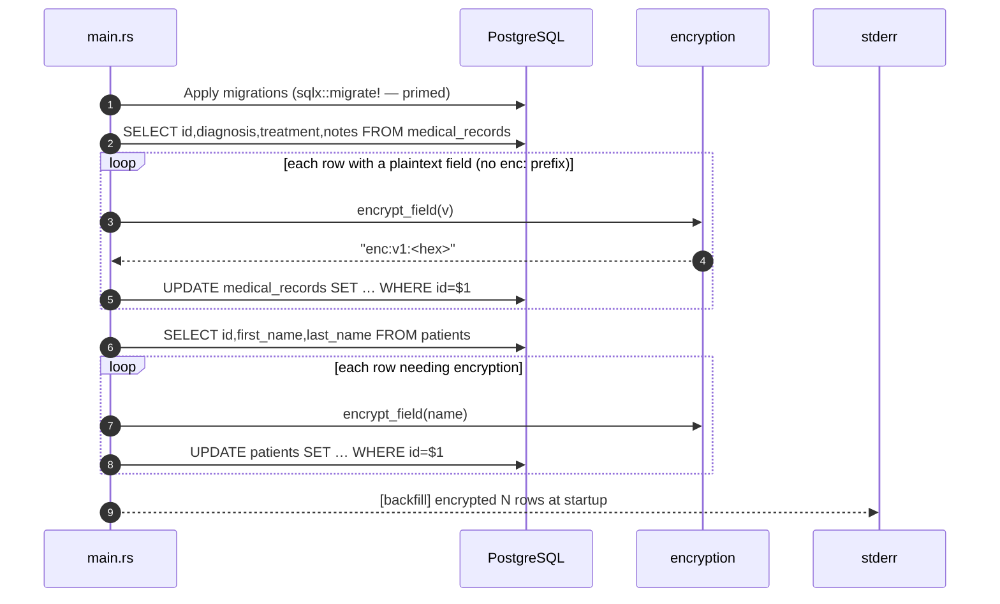
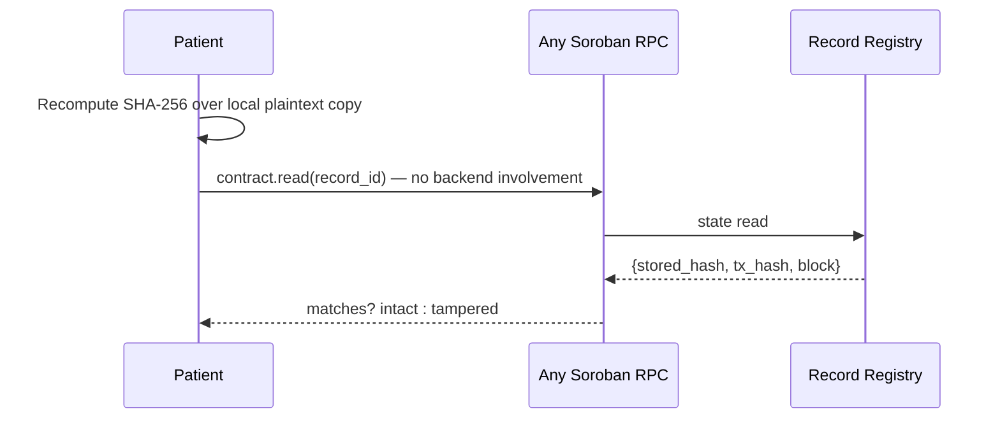

# Data Flow Diagrams

Sequence diagrams for the canonical flows. Rendered with Mermaid (works on GitHub and most Markdown viewers).

---

## 1. Login + Token Refresh

**Notes**
- Login is rate-limited per IP (`services/rate_limit.rs`).
- Refresh requires a still-decodable token; if the old token is beyond expiry, the client must re-login.
- Frontend `AuthContext` also enforces a 60-second idle timeout independent of JWT expiry.

---

## 2. Patient-Record Create (with encryption + blockchain anchor)

**Invariants**
- Record hash is computed **over plaintext** before encryption, so off-chain recomputation by someone with plaintext remains possible.
- Response decrypts before returning — the client never sees ciphertext.

---

## 3. Record Verification (current behavior)

**Known limitation (see `docs/security-model.md`).** When a record is edited, `update_record` writes a fresh hash to Record Registry. Verification therefore compares the current DB hash to a chain entry that was *also* written by the current backend, so in-place tampering by a rogue backend operator is not detected end-to-end.

**Proposed mitigation** (future work): `store_hash` should refuse to overwrite. Updates should append a new versioned hash with a tombstone to the prior version.

---

## 4. Permission Grant (patient → staff)

**Known limitation.** The DB row is the enforcement point. No endpoint queries Access Manager's `check_access` before serving data. On-chain grant is a mirror, not a gate.

---

## 5. Audit Read

**Note.** Patients cannot currently see "who accessed my record" — a compliance gap tracked in `docs/compliance.md`.

---

## 6. Startup Backfill (encryption)

Idempotent. Safe to restart; already-encrypted rows are skipped.

---

## 7. Future Flows (not yet implemented)

Stubbed here for thesis roadmap.

### 7.1 Independent patient verification (proposed)

This requires: public proof at record creation time (patient must receive `tx_hash + block_height` and the plaintext the hash was computed over).

### 7.2 Multi-sig access grant (proposed)

Grant requires on-chain signatures from both patient and provider before Access Manager sets the active bit. Prevents unilateral admin grants.

### 7.3 Tamper alert UI (proposed)

If DB record_hash ≠ latest on-chain hash for that record_id, surface a red banner on the record card and an admin alert.
